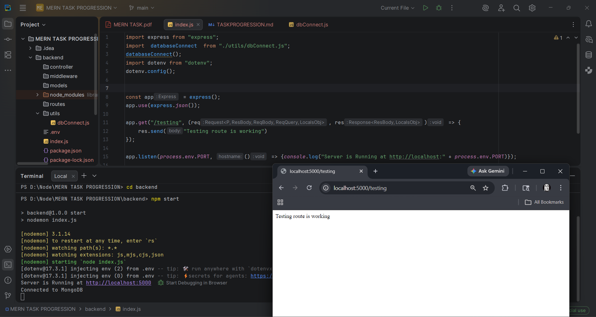

# 🚀 MERN 20-Day Progress Tracker

This file tracks my daily progress for becoming a job-ready MERN backend developer.

---

## 📊 Overall Progress

- Total Days: 20
- Completed: 1
- Remaining: 20

---

## 🟢 Week 1: Backend Foundation

### ✅ Day 1 – Server Setup
**Status:** ⬜ Pending  
**Backend Task:**
- Setup Express server
- Connect MongoDB

**Frontend Task:**
- Create React app
- Basic layout

**What I Learned:**
- 

**Screenshot:**

---

### ✅ Day 2 – CRUD API
**Status:** ⬜ Pending  

**Backend Task:**
- Create GET, POST, PUT, DELETE APIs

**Frontend Task:**
- Static task list UI

**What I Learned:**
- 

**Screenshot:**

---

### ✅ Day 3 – Validation
**Status:** ⬜ Pending  

**Backend Task:**
- Mongoose schema + validation

**Frontend Task:**
- Dynamic rendering

**What I Learned:**
- 

**Screenshot:**

---

### ✅ Day 4 – MVC Structure
**Status:** ⬜ Pending  

**Backend Task:**
- Controllers, Routes, Models

**Frontend Task:**
- Component structure

**What I Learned:**
- 

**Screenshot:**

---

### ✅ Day 5 – Error Handling
**Status:** ⬜ Pending  

**Backend Task:**
- Global error middleware

**Frontend Task:**
- Show error UI

**What I Learned:**
- 

**Screenshot:**

---

## 🟡 Week 2: Authentication & Security

### ✅ Day 6 – Register API
**Status:** ⬜ Pending  

**Backend Task:**
- Register + bcrypt

**Frontend Task:**
- Signup UI

**What I Learned:**
- 

**Screenshot:**

---

### ✅ Day 7 – Login API
**Status:** ⬜ Pending  

**Backend Task:**
- Login + JWT

**Frontend Task:**
- Login UI

**What I Learned:**
- 

**Screenshot:**

---

### ✅ Day 8 – Auth Middleware
**Status:** ⬜ Pending  

**Backend Task:**
- Protect routes

**Frontend Task:**
- Protected pages

**What I Learned:**
- 

**Screenshot:**

---

### ✅ Day 9 – Role-Based Access
**Status:** ⬜ Pending  

**Backend Task:**
- Admin/User roles

**Frontend Task:**
- Conditional UI

**What I Learned:**
- 

**Screenshot:**

---

### ✅ Day 10 – Rate Limiting
**Status:** ⬜ Pending  

**Backend Task:**
- Rate limiting

**Frontend Task:**
- Error handling UI

**What I Learned:**
- 

**Screenshot:**

---

## 🔵 Week 3: Advanced Features

### ✅ Day 11 – Pagination
**Status:** ⬜ Pending  

### ✅ Day 12 – Search & Filter
**Status:** ⬜ Pending  

### ✅ Day 13 – File Upload
**Status:** ⬜ Pending  

### ✅ Day 14 – Logging
**Status:** ⬜ Pending  

### ✅ Day 15 – Environment Variables
**Status:** ⬜ Pending  

---

## 🔴 Week 4: Production Ready

### ✅ Day 16 – Caching
**Status:** ⬜ Pending  

### ✅ Day 17 – API Docs
**Status:** ⬜ Pending  

### ✅ Day 18 – DB Optimization
**Status:** ⬜ Pending  

### ✅ Day 19 – Deployment
**Status:** ⬜ Pending  

### ✅ Day 20 – Final Project
**Status:** ⬜ Pending  

---

# 🏁 Final Goal

Build a **production-ready MERN Progress Tracker App** with:

- Authentication 🔐
- API Security ⚡
- GitHub Integration 🔗
- Dashboard UI 📊

---

# 📌 Rules I Follow

- Daily commit on GitHub
- Daily LinkedIn post
- Add screenshot proof
- Focus on learning, not copying

---

🔥 Let’s build consistency and become job-ready!